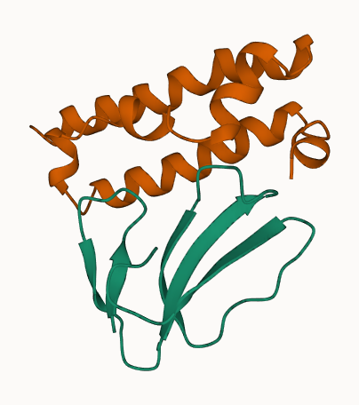
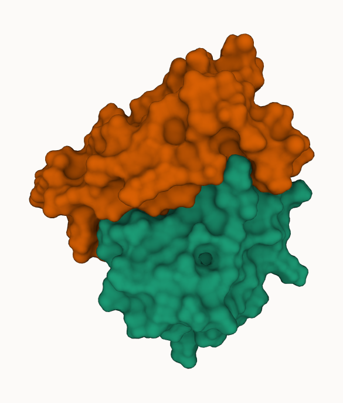

# ToxBind: Snake Venom Binder

## Binder table

Note: Designed binders are not yet validated experimentally.

Binder table: [final_results.csv](./final_results.csv)

Large files (Trajectory animations, plots) are not tracked in this repository due to size constraints.
Please download them from:

- [Google Drive Link](https://drive.google.com/drive/folders/1Gxfo3N9OhU5ZyxvZsio3WGBP6lHr02mt)

## Introduction

This is a repository for the snake venom binder project using BindCraft. The project is based on the paper "De novo designed proteins neutralize lethal snake venom toxins" by the Baker lab (Awesome work). The paper describes the design of a protein that can neutralize snake venom toxins.

Paper link:
De novo-designed proteins neutralize lethal snake venom toxins
https://www.nature.com/articles/s41586-024-08393-x

## Designed Snake Venom Binder

One of the binder in cartoon and molecular surface representation.

 

## TODO

- [ ] Combine all workflow into one
- [ ] Add target sequence, PBD ID of target sequence, Date and BindCraft version
- [ ] Add GCP backend also

## References & Useful Links

Article:
https://www.bakerlab.org/2025/01/15/neutralizing-deadly-snake-toxins/

Crystal structure of the a-cobratoxin-AChBP complex
https://www.rcsb.org/3d-view/1YI5

https://en.wikipedia.org/wiki/Snake_venom
https://www.sciencedirect.com/science/article/abs/pii/B9780124158139000143
https://en.wikipedia.org/wiki/Amino_acid
